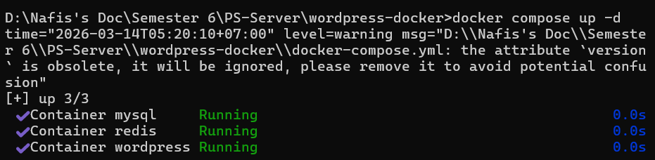
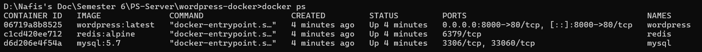
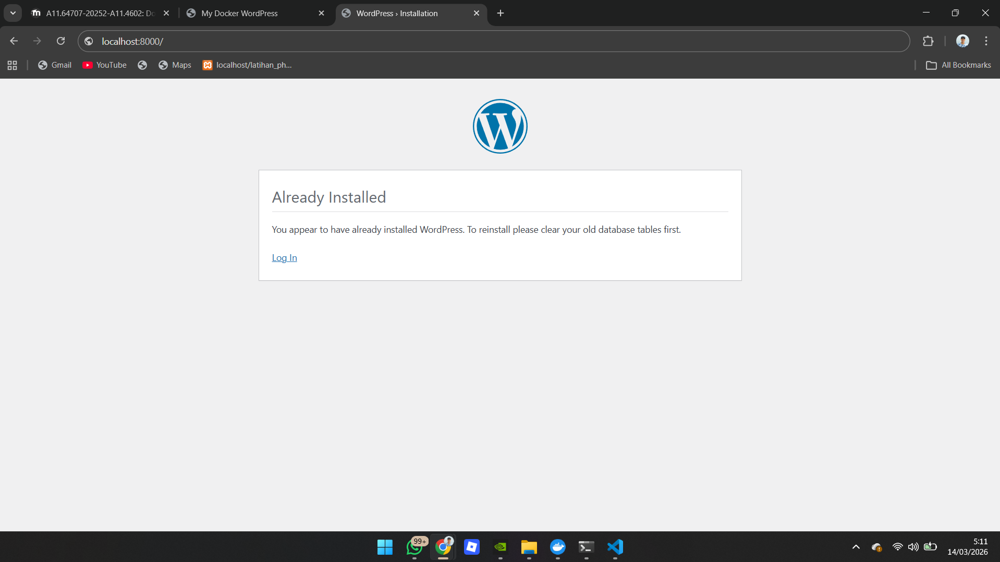
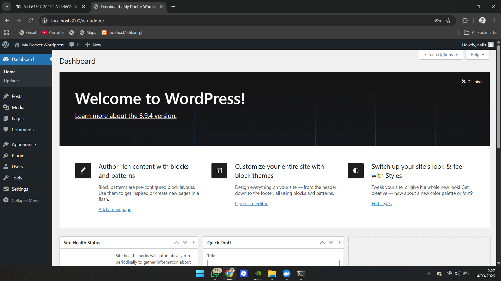
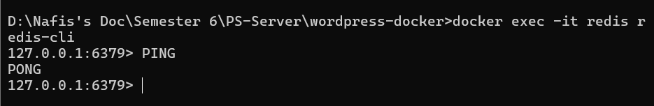
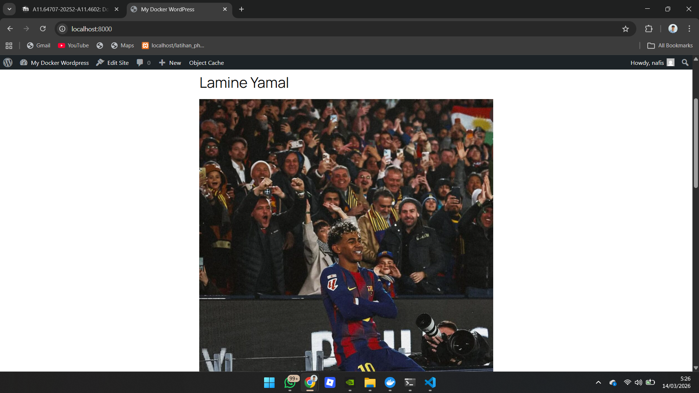

# WordPress Docker Stack (WordPress + MySQL + Redis)

Project ini menjalankan WordPress menggunakan Docker dengan MySQL sebagai database dan Redis sebagai caching system untuk meningkatkan performa website.

---

# Teknologi yang Digunakan

* Docker
* Docker Compose
* WordPress
* MySQL
* Redis

---

# Arsitektur Sistem

Stack ini terdiri dari tiga container utama:

1. **WordPress** → aplikasi CMS
2. **MySQL** → database untuk menyimpan data WordPress
3. **Redis** → caching system untuk mempercepat akses data

Semua container dijalankan menggunakan **Docker Compose** sehingga mudah untuk di-deploy dan dikelola.

---

# Cara Menjalankan Project

## 1. Masuk ke Folder Project

Buka terminal kemudian masuk ke folder project:

```
cd wordpress-docker
```

---

## 2. Menjalankan Docker Container

Jalankan stack menggunakan perintah berikut:

```
docker compose up -d
```


Perintah ini akan menjalankan tiga container:

* wordpress
* mysql
* redis

---

## 3. Memastikan Container Berjalan

Gunakan perintah berikut untuk memastikan container berjalan:

```
docker ps
```



---

## 4. Mengakses WordPress

Setelah container berjalan, buka browser dan akses:

```
http://localhost:8000
```

Halaman instalasi WordPress akan muncul.


---

## 5. Melakukan Instalasi WordPress

Isi informasi berikut pada halaman instalasi:

* Site Title
* Username
* Password
* Email


Kemudian klik **Install WordPress**.

---

## 6. Login ke Dashboard WordPress

Setelah instalasi selesai, login ke dashboard melalui:

```
http://localhost:8000/wp-admin
```

Masukkan username dan password yang telah dibuat.

### Screenshot WordPress Dashboard



---

## 7. Testing Redis Cache

Masuk ke Redis CLI dengan perintah berikut:

```
docker exec -it redis redis-cli
```

Kemudian jalankan perintah:

```
PING
```

Jika Redis berjalan dengan baik maka akan muncul output:

```
PONG
```




---

# Testing dan Verifikasi

Berikut hasil pengujian stack:



| Komponen         | Status    |
| ---------------- | --------- |
| WordPress        | Running   |
| MySQL            | Running   |
| Redis            | Running   |
| Redis Cache      | Connected |
| Data Persistence | Working   |

---

# Jawaban Pertanyaan

## 1. Kenapa perlu volume untuk MySQL?

Volume digunakan untuk menyimpan data database secara persisten.
Jika container MySQL dihentikan atau dihapus, data tidak akan hilang karena disimpan di volume Docker.

---

## 2. Apa fungsi depends_on?

`depends_on` digunakan untuk menentukan urutan startup container.
Misalnya WordPress membutuhkan MySQL agar dapat berjalan, sehingga MySQL harus dijalankan terlebih dahulu sebelum WordPress.

---

## 3. Bagaimana cara WordPress container connect ke MySQL?

WordPress terhubung ke MySQL melalui konfigurasi database pada file `wp-config.php`.

Contoh konfigurasi:

```
define('DB_HOST', 'mysql');
```

Karena menggunakan Docker Compose, WordPress dapat mengakses MySQL menggunakan **nama service mysql sebagai hostname**.

---

## 4. Apa keuntungan menggunakan Redis untuk WordPress?

Redis berfungsi sebagai **object cache** yang menyimpan data sementara di memory.

Keuntungan menggunakan Redis:

* mempercepat loading website
* mengurangi query ke database
* meningkatkan performa WordPress
* mengurangi beban server

---

# Author

Muchamad Nafis Aljufri - A11.2023.15328